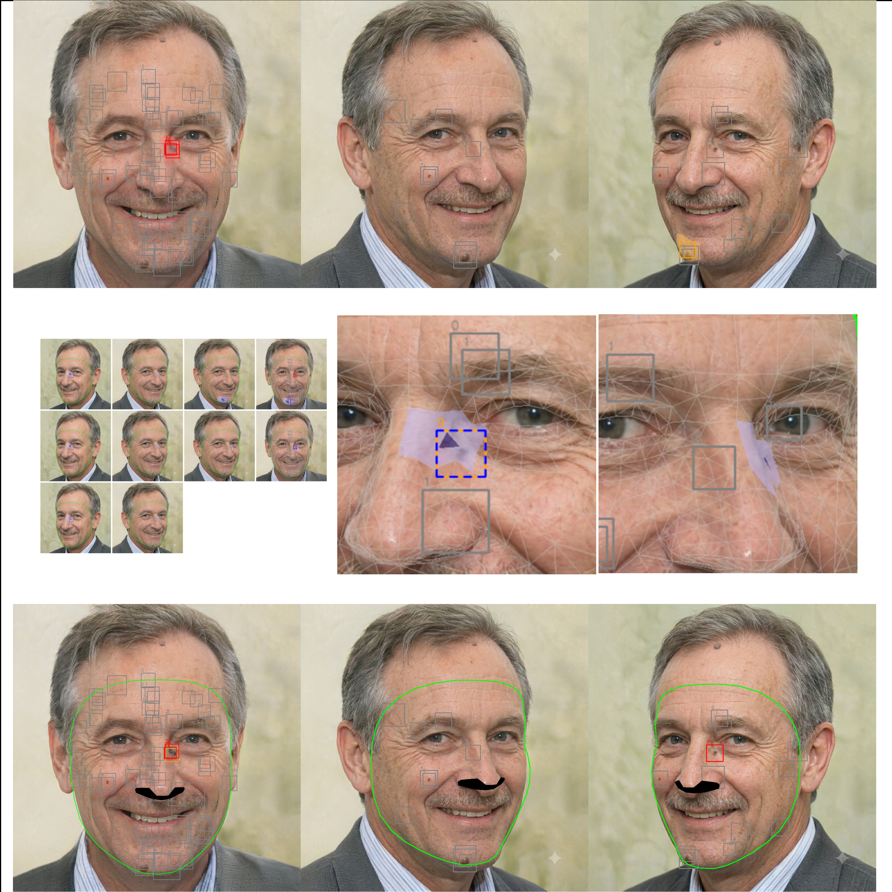

# Figure 1 Generation



The figure above (`Fig1_guetzli.jpg`) was generated using the Python scripts and demo `.jpg` files provided in this `fig1` directory.

## Prerequisites
This script is strictly requires **Mediapipe version 0.10.21**. Please install the exact version using the command below:

```bash
pip3 install mediapipe==0.10.21